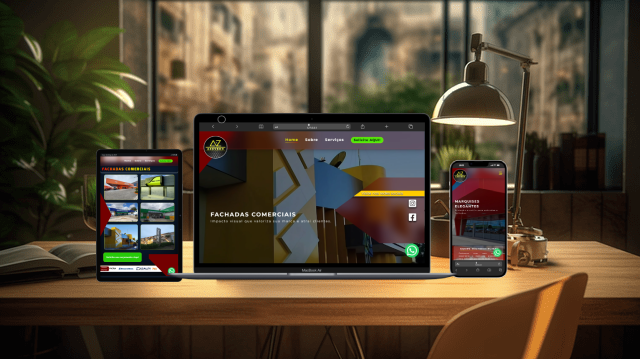

# AZ Comunicação Visual

- 🌐 Demo: https://geilsonfreire.github.io/az-comunicacao-visual/
- 🌐 Repositorio: https://github.com/geilsonfreire/az-comunicacao-visual

Site institucional da AZ Comunicação Visual com foco em portfólio de serviços, presença digital e contato rápido via WhatsApp. Projeto front-end estático em HTML, CSS e JavaScript, com seções de serviços, carrossel no hero, menu responsivo e elementos visuais animados.

## 🖼 Preview do Projeto




## 🌐 Visão Geral
Este projeto apresenta:
- Carrossel no hero com indicadores e rotação automática.
- Seções de serviços 
    - Fachadas 
    - Totens 
    - Brises 
    - Letreiros 
    - Portas de ACM 
    - Marquises 
    - Pergolados
- Menu responsivo com dropdown e navegação por âncoras.
- Botão flutuante do WhatsApp com tooltip e caixa de chat.
- Vídeo e cards de apresentação institucional.
- Efeitos visuais e labels decorativas.

## 🧰 Tecnologias Utilizadas
- O projeto foi desenvolvido utilizando tecnologias front-end modernas:
    - HTML5
    - CSS3 (arquivos modulares)
    - JavaScript (interações e efeitos)
    - Tailwind via CDN
    - Font Awesome via CDN

## 📁 Estrutura do Projeto
```
assets/            # imagens e videos
css/               # estilos por seções
js/                # scripts auxiliares
public/            # favicon
index.html         # página principal
script.js          # interações do carrossel e navegação
```

## 🚀 Como Executar o Projeto
- Projeto estático. Você pode:
    1. Abrir `index.html` diretamente no navegador.
    2. Usar um servidor estático (ex: Live Server no VS Code) para melhor experiência.

## 📌 Serviços Apresentados no Site

- O site destaca os principais serviços oferecidos pela empresa:

    - Fachadas Comerciais
    - Totens Corporativos
    - Ripados
    - Brises Arquitetônicos
    - Letreiros
    - Portas de ACM
    - Marquises
    - Pergolados

---

## 📱 Funcionalidades

- Layout totalmente **responsivo**
- **Menu mobile com botão hamburguer**
- **Dropdown interativo**
- **Carrossel automático**
- **Integração com WhatsApp**
- **Tooltip e caixa de chat**
- **Elementos visuais animados**

---

## 👨‍💻 Autores

Projeto desenvolvido por:

- **Geilson Freire**
- **Pedro Augusto**

---

## 📄 Licença

Este projeto foi desenvolvido para fins institucionais da **AZ Comunicação Visual**
